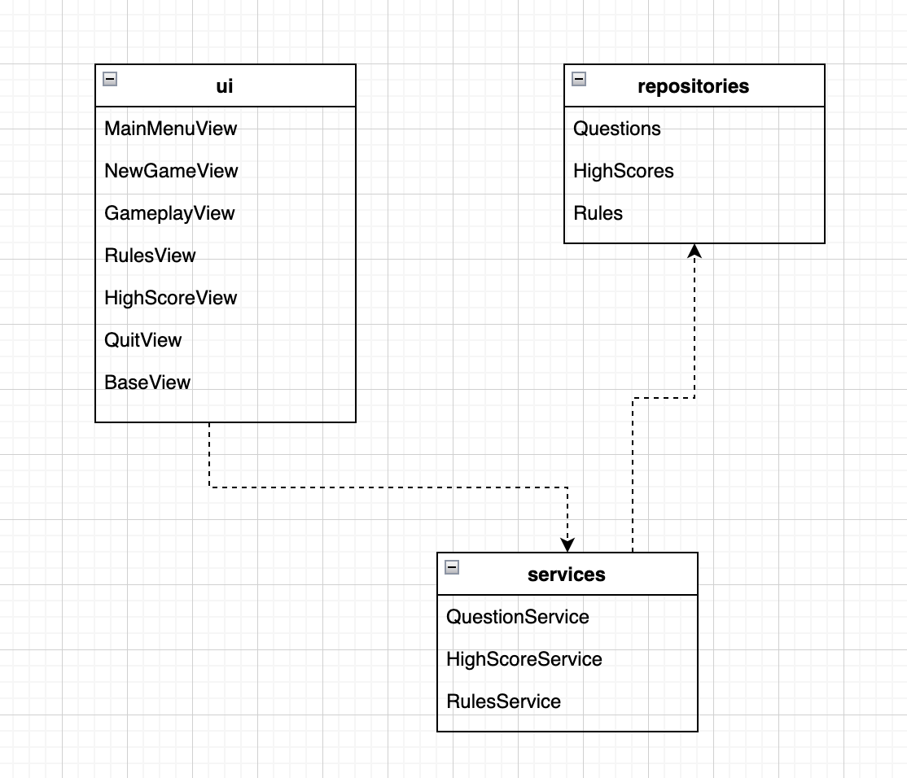
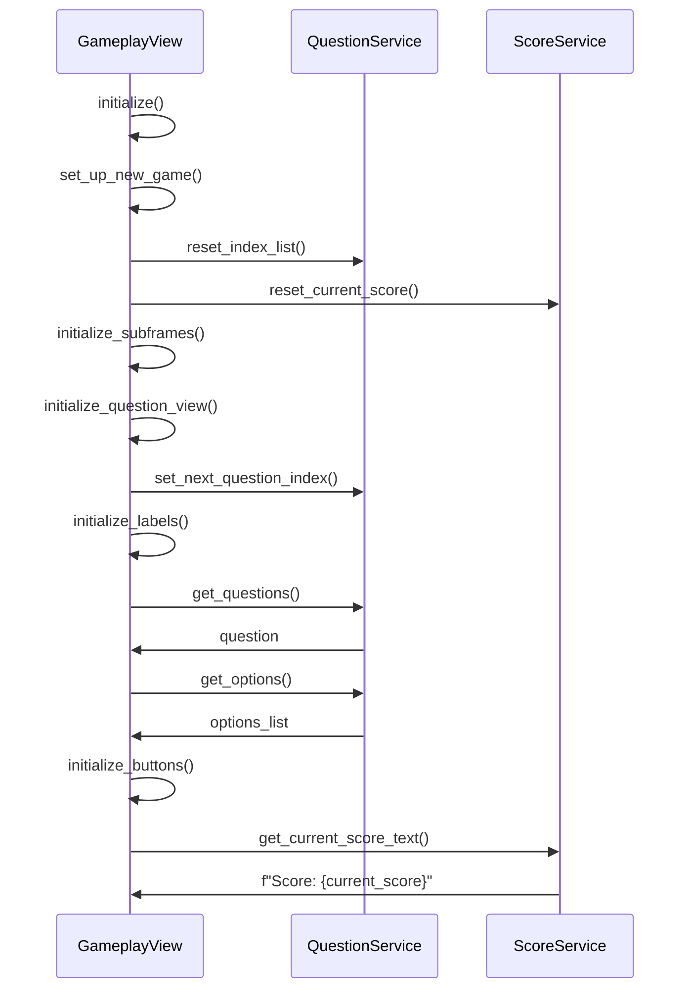
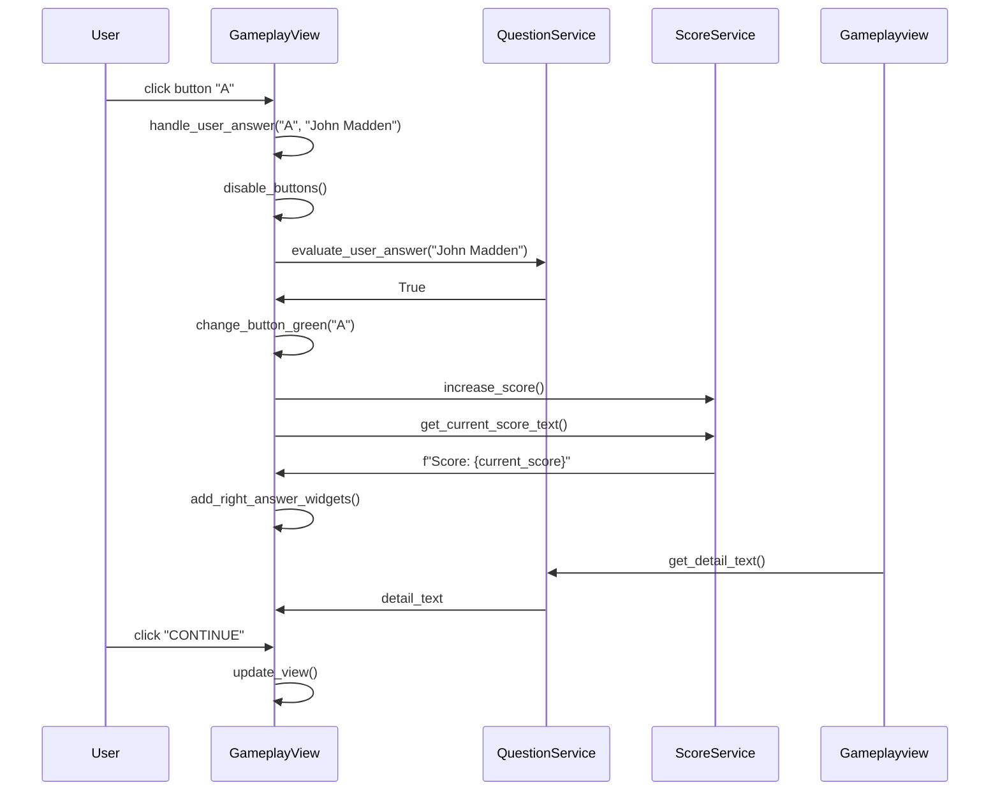
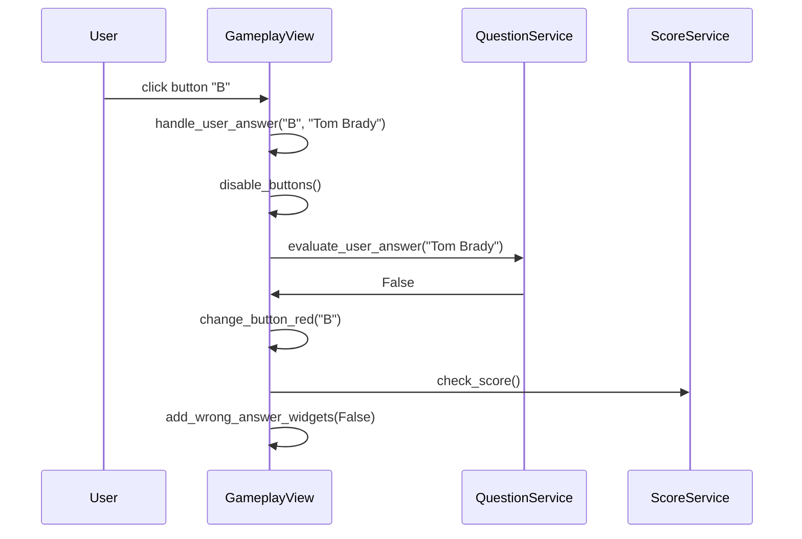

# Arkkitehtuurikuvaus

## Rakenne

Ohjelman koodin pakkausrakenne on seuraavanlainen:

Käyttöliittymästä vastaava koodi sijaitsee pakkauksessa _ui_.

Sovelluslogiikasta vastaava koodi sijaitsee pakkauksessa _services_.

Tietojen pysyväistalletuksesta vastaava koodi sijaitsee pakkauksessa _repositories_.

## Käyttöliittymä

Käyttöliittymä sisältää seitsemän erilaista näkymää:

- Aloitus
- Päävalikko
- Uusi peli
- Pelinkulku
- Parhaat tulokset
- Säännöt
- Lopetus

Näistä näkymistä pelinkulku on dynaaminen näkymä, jonka sisältö vaihtuu kysymysten mukana.

Kaikki näkymät on toteutettu omana luokkanaan ja niistä vain yksi näkyy kerrallaan. Ulkoasun 
yhtenäistämiseksi ja koodin toiston välttämiseksi kaikki yllä olevat näkymäluokat perivat 
luokan _BaseView_, jonka luoman pohjakehyksen päälle näkymät rakentuvat. Näkymien 
näyttämisestä ja hallinnoinnista vastaa luokka _UI_. Käyttöliittymä on pyritty eristämään 
sovelluslogiikasta, josta vastaa puolestaan sovelluksen _services_-luokat.

## Sovelluslogiikka

Sovelluslogiikasta vastaavat luokat _QuestionService_ ja _ScoreService_.

_QuestionService_-luokka tarjoaa käyttöliittymän pelinkulkunäkymästä vastaavalle 
_GameplayView_-luokalle erinäisiä pelin kysymysaineistoon liittyviä metodeja, joita ovat 
esimerkiksi:

- `set_next_question_index`
- `get_question()`
- `get_options()`
- `get_detail_text()`
- `evaluate_user_answer(user_answer)`

Näitä metodeja hyödyntämällä käyttöliittymän luokka saa tarvittavat pelin kysymyksiin 
liittyvät tiedot esitettäviksi, voi tarkistaa käyttäjän antaman vastauksen 
oikeellisuuden, ja pystyy siirtymään seuraavaan kysymykseen.

_ScoreService_ on toinen sovelluslogiikasta vastaavista luokista. Se tarjoaa käyttöliittymän eri 
luokille muun muassa seuraavia metodeja:

- `get_current_score()`
- `reset_current_score()`
- `get_high_score()`
- `get_high_scores_list()`
- `get_selected_team()`
- `change_selected_team(new_team)`
- `increase_score()`
- `check_score()`
- `store_high_scores()`

Metodit tarjoavat käyttöliittymälle tietoa sekä sillä hetkellä käynnissä olevan pelin tuloksesta 
että parhaasta kokonaisuutena siihen asti saavutetusta tuloksesta. Parhaan tuloksen varsinaisesta
tallentamisesta vastaa kuitenkin pakkauksen _repositories_ luokka _HighScoreRepository_.

## Tietojen hallinnointi ja tallennus

Pakkauksen _repositories_ luokat _QuestionRepository_ ja _HighScoreRepository_ 
vastaavat kysymysaineiston tuomisesta peliin sekä tulosten tallettamisesta. 

_QuestionRepository_-luokka lataa sovelluksen käynnistyessä pelin kysymysaineiston (eli 
kysymykset, vastausvaihtoehdot, oikeat vastaukset ja kysymyksiin liittyvät lisätiedot) sovellukseen 
lukemalla csv-tiedostoa. Kysymysaineisto talletetaan sovelluksessa listana sanakirjoja.

_HighScoreRepository_-luokka tallettaa 10 parasta pelistä saavutettua tulosta csv-tiedostoon. Mikäli 
tiedostoa ei löydy, luo luokka sen automaattisesti sovelluksen käynnistymisen yhteydessä.

## Päätoiminnallisuudet

### Pelinkulun alku

### Käyttäjä vastaa oikein

## Käyttäjä vastaa väärin

