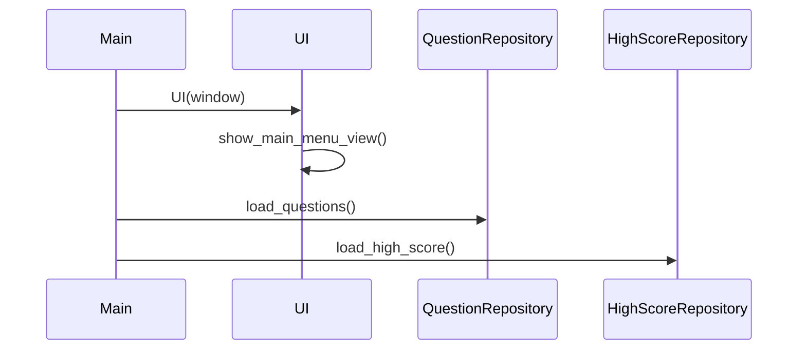
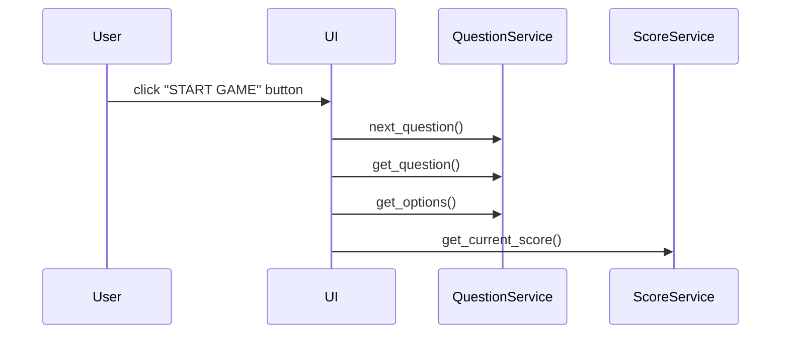

# Arkkitehtuurikuvaus

## Rakenne

Ohjelman koodin pakkausrakenne on seuraavanlainen:

Käyttöliittymästä vastaava koodi sijaitsee pakkauksessa _ui_.

Sovelluslogiikasta vastaava koodi sijaitsee pakkauksessa _services_.

Tietojen pysyväistalletuksesta vastaava koodi sijaitsee pakkauksessa _repositories_.

## Käyttöliittymä

Käyttöliittymä sisältää viisi erilaista näkymää:

- Päävalikko
- Säännöt (vielä työn alla)
- Uusi peli
- Pelinkulku
- Lopetus

Näistä näkymistä pelinkulku on dynaaminen näkymä, jonka sisältö vaihtuu kysymysten mukana.

Kaikki näkymät on toteutettu omana luokkanaan ja niistä vain yksi näkyy kerrallaan. Ulkoasun 
yhtenäistämiseksi ja koodin toiston välttämiseksi kaikki yllä olevat näkymät peruvat 
perusnäkymän _ BaseView_, jonka luoman kehyksen päälle ne rakentuvat. Näkymien 
hallinnoinnista 
vastaa luokka _ UI_. Käyttöliittymä on pyritty eristämään sovelluslogiikasta, 
josta vastaa puolestaan sovelluksen _services_-luokat.

## Sovelluslogiikka

Sovelluslogiikasta vastaavat luokat _QuestionService_ ja _ScoreService_.

_QuestionService_-luokka tarjoaa käyttöliittymän pelinkulun esittämisestä vastaavalle 
_GameplayView_-luokalle erinäisiä kysymyksiin liittyviä metodeja, joita ovat:

- `get_question()`
- `get_options()`
- `get_detail_text()`
- `check_answer(user_answer)`
- `set_next_question_key()`

Näitä metodeja hyödyntämällä käyttöliittymän luokka saa tarvittavat pelin kysymyksiin 
liittyvät tiedot esitettäviksi, voi tarkistaa käyttäjän antaman vastauksen 
oikeellisuuden, ja pystyy siirtymään seuraavaan kysymykseen.

_ScoreService_ on toistaiseksi suoraviivaisempi sovelluslogiikan luokka, joka tarjoaa 
käyttöliittymälle seuraavia metodeja:

- `get_current_score()`
- `get_high_score()`
- `increase_score()`
- `check_score()`

Metodit tarjoaa käyttöliittymälle tietoa sekä sillä hetkellä käynnissä olevan pelin tuloksesta että 
parhaasta kokonaisuutena siihen asti saavutetusta tuloksesta. Parhaan tuloksen 
tallentamisesta vastaa kuitenkin pakkauksen _repositories_ luokka _HighScoreRepository_.

## Tietojen hallinnointi ja tallennus

Pakkauksen _repositories_ luokat _QuestionRepository_ ja _HighScoreRepository_ 
vastaavat tietojen tuomisesta peliin sekä tulosten tallettamisesta. 

_QuestionRepository_-luokka tallettaa sovelluksen käynnistyessä sanakirjaan 
pelin kysymykset, vastausvaihtoehdot, oikeat vastaukset sekä kysymykseen 
liittyvät lisätiedot lukemalla csv-tiedostoa.

_HighScoreRepository_-luokka tallettaa tässä vaiheessa vain parhaan yksittäisen 
pelissä saavutetun tuloksen csv-tiedostoon, mutta tätä toteutusta on 
mahdollista vielä laajentaa.

## Päätoiminnallisuudet

### Sovelluksen käynnistyminen

### Uuden pelin aloittaminen

