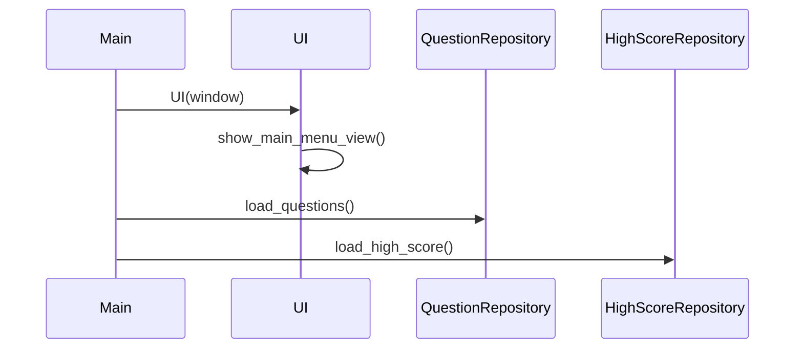
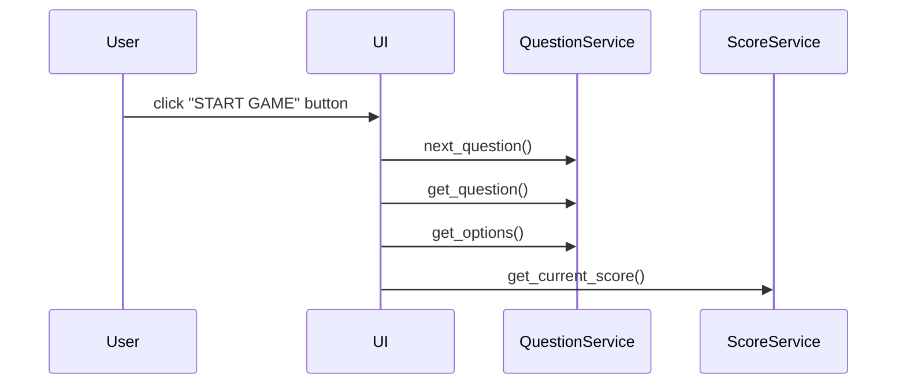

# Arkkitehtuurikuvaus

## Rakenne

Ohjelman koodin pakkausrakenne on seuraavanlainen:

Käyttöliittymästä vastaava koodi sijaitsee pakkauksessa _ui_.

Sovelluslogiikasta vastaava koodi sijaitsee pakkauksessa _services_.

Tietojen pysyväistalletuksesta vastaava koodi sijaitsee pakkauksessa _repositories_.

## Käyttöliittymä

Käyttöliittymä sisältää viisi erilaista näkymää:

- Päävalikko
- Säännöt (vielä työn alla)
- Uusi peli
- Pelinkulku
- Lopetus

Näistä näkymistä pelinkulku on dynaaminen näkymä, jonka sisältö vaihtuu kysymysten mukana.

Kaikki näkymät on toteutettu omana luokkanaan ja niistä vain yksi näkyy kerrallaan. Ulkoasun 
yhtenäistämiseksi ja koodin toiston välttämiseksi kaikki yllä olevat näkymät peruvat 
perusnäkymän BaseView, jonka luoman kehyksen päälle ne rakentuvat. Näkymien hallinnoinnista 
vastaa luokka UI. Käyttöliittymä on pyritty eristämään sovelluslogiikasta, josta vastaa 
puolestaan sovelluksen services-luokat.

## Sovelluslogiikka

## Päätoiminnallisuudet

### Sovelluksen käynnistyminen

### Uuden pelin aloittaminen

