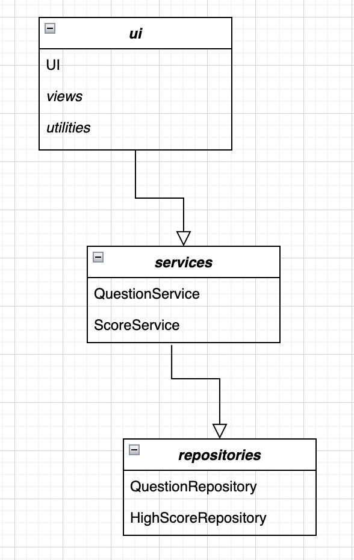

# Arkkitehtuurikuvaus

## Rakenne

Sovellus noudattaa rakenteeltaan kolmitasoista kerrosarkkitehtuuria ja on pakkausrakenteeltaan hyvin suoraviivainen:

Käyttöliittymästä vastaava koodi sijaitsee pakkauksessa _ui_.

Sovelluksen eri näkymistä vastaava koodi sijaitsee pakkauksen _ui_ alapakkaukseen _views_.

Käyttöliittymän tukitoiminnoista vastaava koodi sijaitsee puolestaan pakkauksen _ui_ alapakkauksessa 
_utilities_.

Sovelluslogiikasta vastaava koodi sijaitsee pakkauksessa _services_.

Tietojen pysyväistalletuksesta vastaava koodi sijaitsee pakkauksessa _repositories_.

## Käyttöliittymä

Käyttöliittymä sisältää kahdeksan erilaista näkymää:

- Päävalikko
- Uuden pelin valikko
- Pelinkulun näkymä
- Parhaat tulokset
- Säännöt
- Pelin läpäisy
- Virhetilanne
- Lopetus

Näistä näkymistä pelinkulku on dynaaminen näkymä, jonka sisältö vaihtuu kysymysten mukana. Kaikki 
näkymät on toteutettu omana luokkanaan ja niistä vain yksi näkyy kerrallaan.

Ulkoasun yhtenäistämiseksi ja koodin toiston välttämiseksi kaikki yllä olevat näkymäluokat perivät
luokan _BaseFrame_, jonka luoman pohjakehyksen päälle näkymät rakentuvat. Näkymien komponenttien 
luomisesta vastaa luokka _WidgetCreator_ ja komponenttien tyylien konfiguroimisesta luokka 
_WidgetStyles_.

Näkymien näyttämisestä ja hallinnoinnista vastaa luokka _UI_. Käyttöliittymä on pyritty 
eristämään sovelluslogiikasta, josta vastaa puolestaan sovelluksen _services_-luokat.

## Sovelluslogiikka

Sovelluslogiikasta vastaavat luokat ovat _QuestionService_ ja _ScoreService_.

_QuestionService_-luokka tarjoaa käyttöliittymän luokille (ennen kaikkea pelinkulkunäkymästä 
vastaavalle _GameplayView_-luokalle) erinäisiä pelin kysymysaineistoon liittyviä metodeja, 
joita ovat esimerkiksi:

- `get_question()`
- `get_options()`
- `get_detail_text()`
- `evaluate_user_answer(user_answer)`
- `confirm_there_are_questions_left()`
- `set_next_question_index()`
- `reset_index_list()`

Näitä metodeja hyödyntämällä käyttöliittymän GameplayView-luokka saa tarvittavat pelin 
kysymyksiin liittyvät tiedot esitettäviksi, voi tarkistaa käyttäjän antaman vastauksen 
oikeellisuuden, ja pystyy siirtymään seuraavaan kysymykseen.

_ScoreService_ on toinen sovelluslogiikasta vastaavista luokista. Se tarjoaa käyttöliittymän eri 
luokille muun muassa seuraavia metodeja:

- `get_current_score()`
- `get_current_score_text()`
- `reset_current_score()`
- `get_high_score()`
- `get_high_scores_list()`
- `reset_high_scores_list()`
- `get_team_names()`
- `get_selected_team()`
- `change_selected_team(new_team)`
- `increase_score()`
- `evaluate_score()`
- `store_high_scores()`

Metodit tarjoavat käyttöliittymälle tietoa ja operaatioita liittyen sekä sillä hetkellä käynnissä 
olevan pelin tuloksesta että parhaista talletetuista tuloksista. Vastuu parhaiden tulosten 
varsinaisesta tallettamisesta kuuluu kuitenkin pakkauksen _repositories_ luokalle 
_HighScoreRepository_.

## Tietojen hallinnointi ja tallennus

Sovelluksen _repositories_-pakkauksen luokat _QuestionRepository_ ja _HighScoreRepository_ 
vastaavat pelin kysymysaineistoon ja pisteytykseen liittyvän tiedon lukemisesta, talletuksesta ja 
muusta käsittelystä.

_QuestionRepository_-luokka tarkastaa sovelluksen käynnistyessä onko pelin kysymysaineiston 
(eli kysymykset, vastausvaihtoehdot, oikeat vastaukset ja vastauksiin liittyvät lisätiedot) 
sisältävä (tsv)-tiedosto talletettu paikallisesti. Mikäli tiedostoa ei ole, tai verkossa on 
tarjolla uudempi versio kyseisestä tiedostosta, lataa sovellus sen määritellystä 
verkko-osoitteesta ja tallettaa tiedoston paikallisesti. Itse sovelluksessa tapahtuvaa 
käsittelyä varten _QuestionRepository_-luokka muuntaa kysymysaineiston listaksi sanakirjoja.

_HighScoreRepository_-luokka tallettaa 10 parasta pelistä saavutettua tulosta 
csv-tiedostoon. Mikäli tiedostoa ei ole, luo luokka sen automaattisesti sovelluksen 
käynnistymisen yhteydessä. Luokka tekee samoin joukkueiden nimet sisältävälle 
csv-tiedostolle.

## Päätoiminnallisuudet

### Pelinkulun alku

### Käyttäjä vastaa oikein

