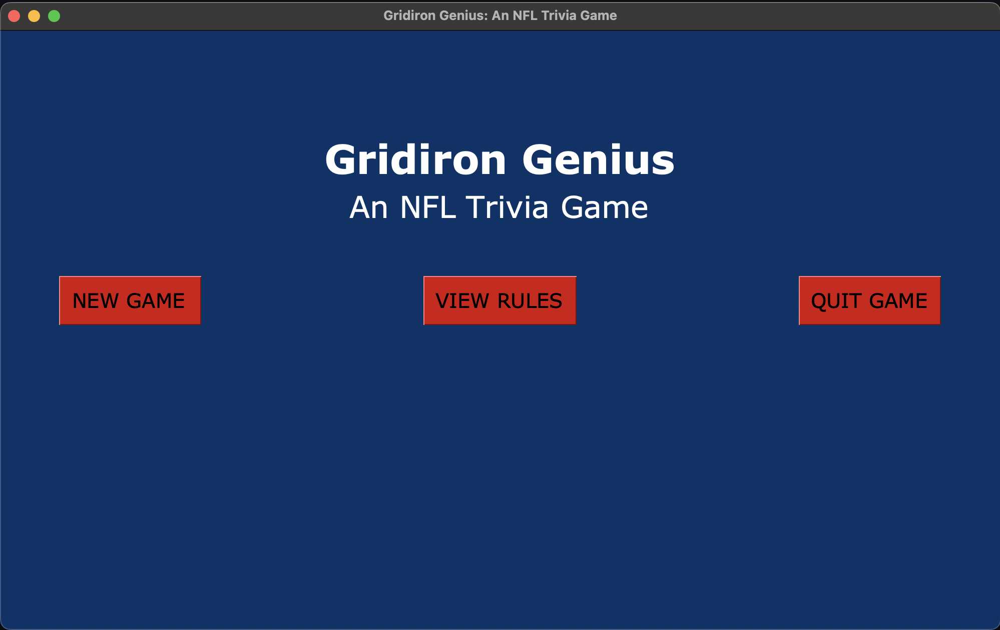
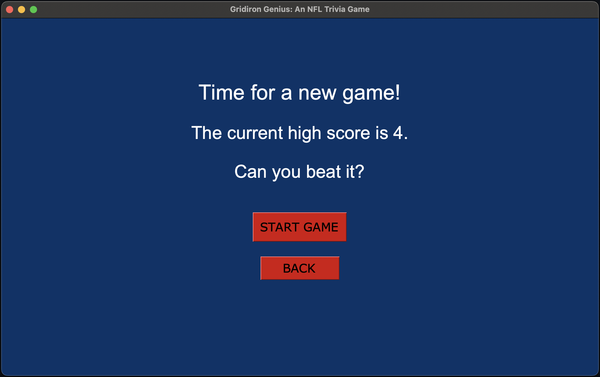
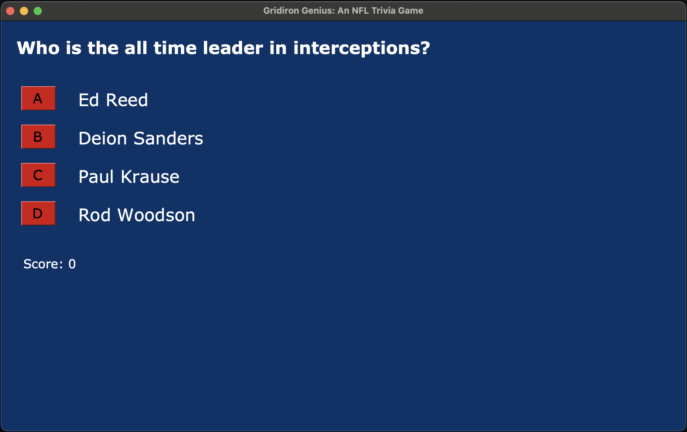
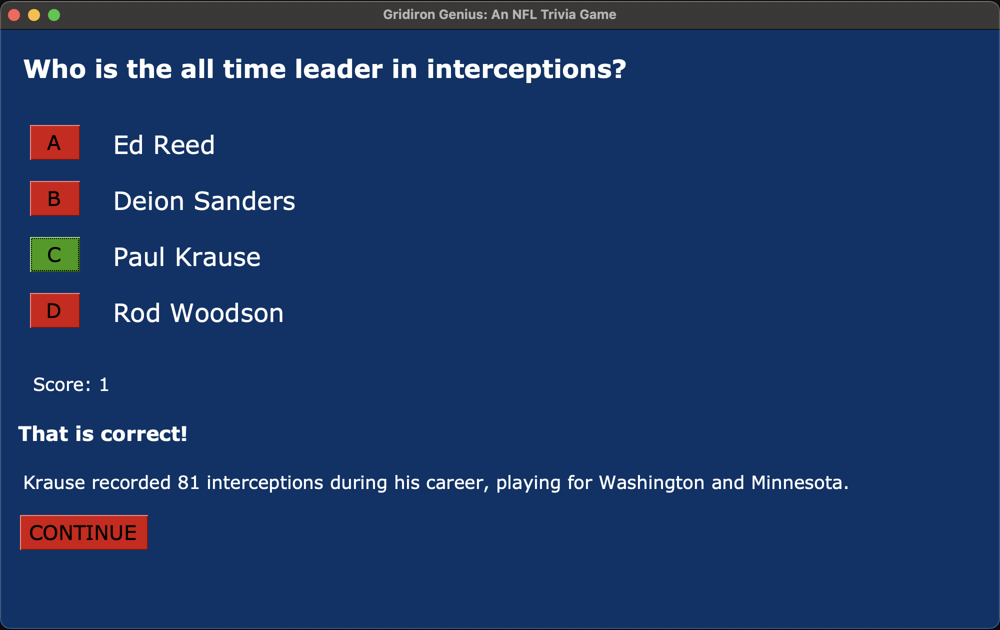
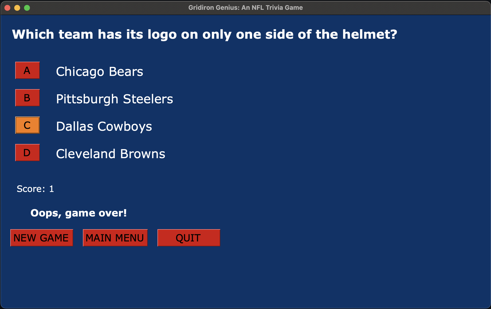
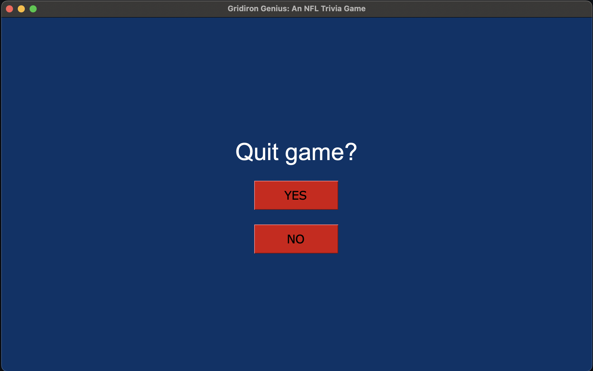

# Käyttöohje

## Päävalikko

Sovellus käynnistyy päävalikon näkymään:

Käyttäjä voi valita uuden pelin painamalla "NEW GAME" -painiketta.

Pelin sääntöjä pääsee tarkastelemaan painamalla "VIEW RULES" -painiketta.

Sovelluksen voi sulkea painamalla "QUIT"-painiketta.

## Uuden pelin aloitus

Pelin alkamista edeltää vielä näkymä, josta käyttäjä näkee pelin 
siihenastisen parhaan tuloksen:

Uusi peli alkaa käyttäjän painettua "START GAME" -painiketta. Käyttäjä voi 
palata takaisin päävalikkoon painamalla "BACK"-painiketta.

## Vastauksen valitseminen

Pelin alettua vaihtuu näkymä seuraavanlaiseksi:

Käyttäjä näkee ruudulta kysymyksen, siihen liittyvät vastausvaihtoehdot 
sekä oman senhetkisen tuloksensa ("Score").

Käyttäjä voi vastata kysymykseen painamalla painiketta "A", "B", "C" tai 
"D" sen vaihtoehdon kohdalla, jonka uskoo olevan oikein.

## Seuraavaan kysymykseen siirtyminen

Mikäli käyttäjän vastaus on oikein, pelikerta jatkuu ja näkymä päivittyy 
seuraavanlaiseksi:

Käyttäjä voi huomata vastauksensa menneen oikein painikkeen vihreäksi 
muuttuneesta väristä sekä lyhyestä tekstimuotoisesta vahvistuksesta.

Käyttäjän pistemäärä ("Score") on kasvanut tässä näkymässä myös yhdellä 
oikein menneen vastauksen myötä.

Käyttäjä voi jatkaa seuraavaan kysymykseen painamalla 
"CONTINUE"-painiketta.

## Pelin päättyminen

Mikäli käyttäjän valitsema vastaus on väärin, päättyy peli ja näkymä 
päivittyy seuraavanlaiseksi:

Käyttäjä voi huomata vastauksensa menneen väärin painikkeen oranssiksi 
muuttuneesta väristä sekä lyhyestä tekstimuotoisesta vahvistuksesta.

Käyttäjä voi valita uuden pelin painamalla "NEW GAME"-painiketta, palata 
takaisin päävalikkoon painamalla "MAIN MENU" -painiketta, ja sulkea 
sovelluksen painamalla "QUIT"-painiketta.

## Sovelluksen sulkeminen

Ennen sovelluksen sulkemista siirrytään näkymään, jossa varmistetaan 
käyttäjän valinta:

Käyttäjä voi sulkea sovelluksen painamalla "YES"-painiketta. 
"NO"-painikkeen painaminen vie takaisin päävalikkoon.
