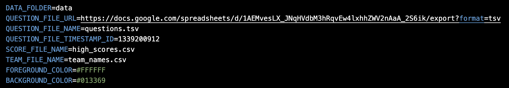
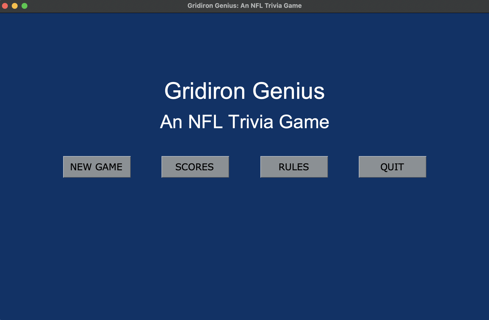
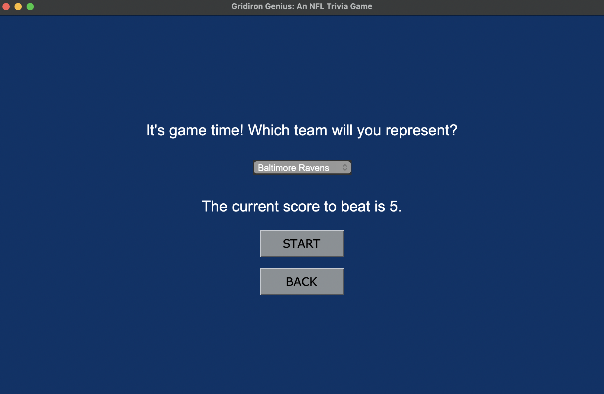
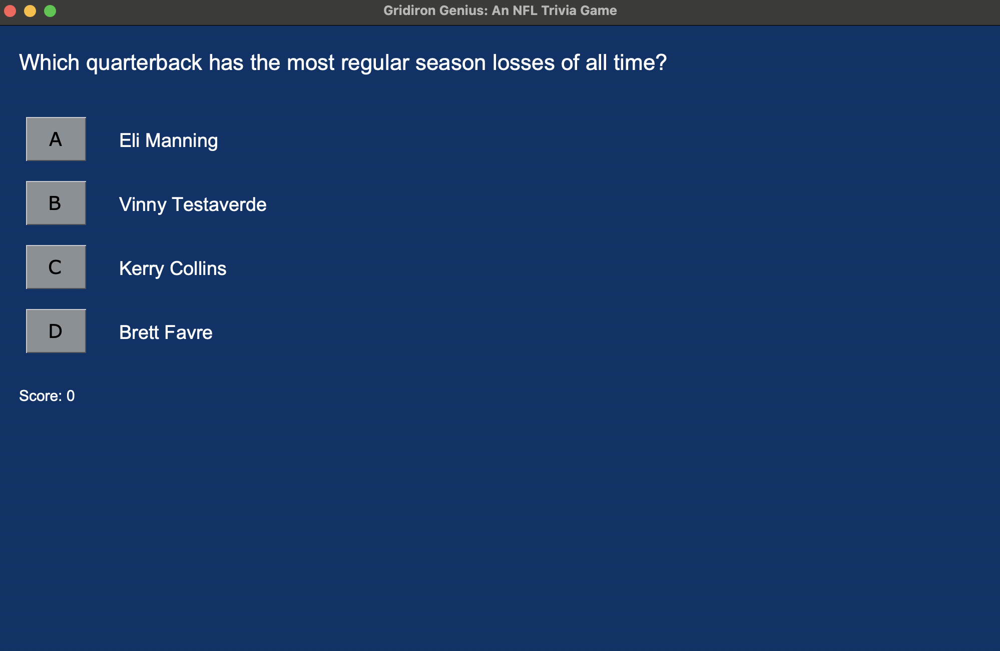
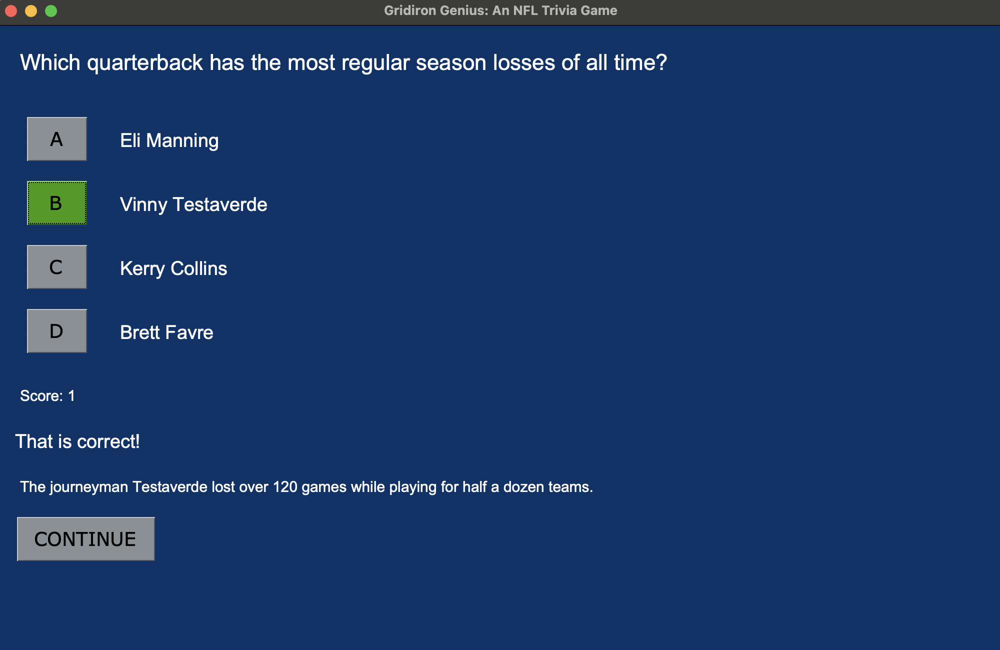
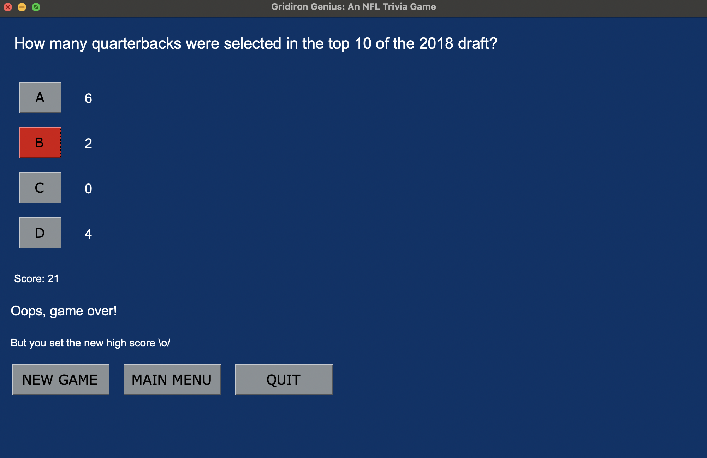
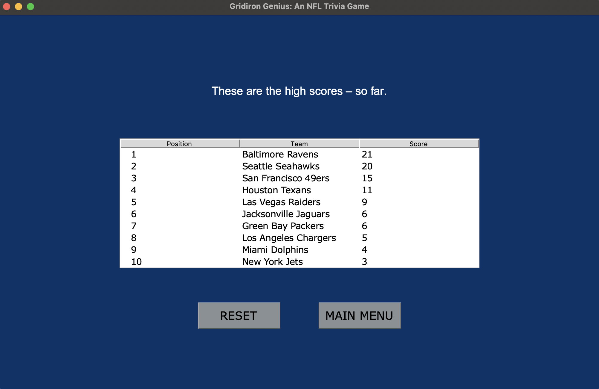
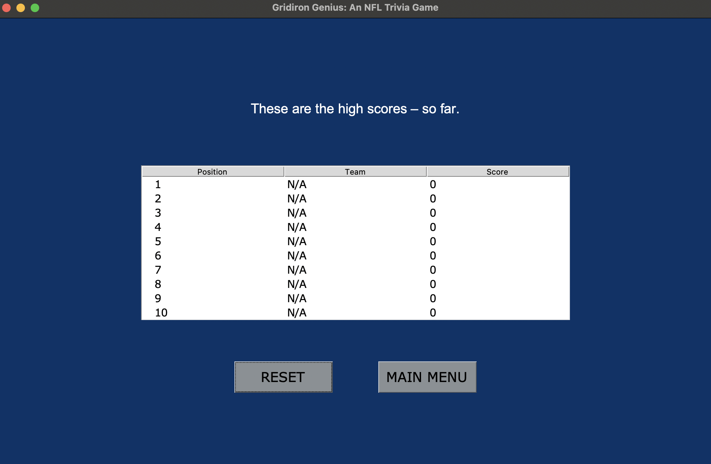
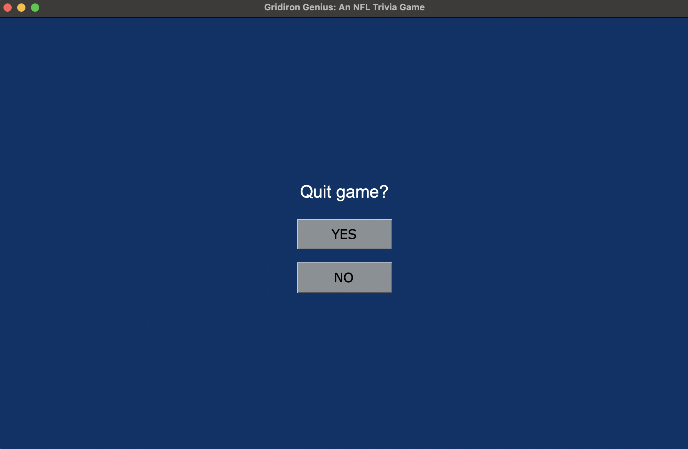

# Käyttöohje

Projektin tuoreimman releasen lähdekoodi on ladattavissa valitsemalla version sivulla _Assets_-osion alta _Source code_.

## Konfigurointi

Sovelluksen konfigurointi on mahdollista käynnistyshakemiston _.env_-tiedostossa, mikäli käyttäjä haluaa muuttaa esimerkiksi sovelluksen 
taustaväriä tai tiedostojen nimiä. Sovelluksen releasen osana olevaa tiedostoa "team_names.csv" muokkaamalla pystyy sovellusta pelaamaan myös 
omalla nimellään tai mieleisellään käyttäjänimellä. Tiedostoa muokatessa on syytä kuitenkin olla tarkkana siitä, että noudattaa sen (hyvin 
yksinkertaista) muotoilua, jotta sovellus osaa jatkossakin sitä lukea ilman virheilmoituksia.



## Ohjelman käynnistäminen

Asenna riippuvuudet ennen käynnistämistä komennolla:

```bash
poetry install
```

Ohjelman voi tämän jälkeen käynnistää komennolla:

```bash
poetry run invoke start
```

## Päävalikko

Sovellus käynnistyy päävalikon näkymään:



Voit valita uuden pelin painamalla "NEW GAME" -painiketta.

Parhaat tulokset saa nähtäville "SCORES" -painiketta painamalla.

Pelin sääntöjä pääsee lukemaan painamalla "RULES" -painiketta.

Sovelluksen voi sulkea painamalla "QUIT"-painiketta.

## Uuden pelin aloitus

Pelin alkamista edeltää näkymä, jossa pääsee valitsemaan 
joukkueensa ja näkee pelin parhaan talletetun tuloksen:



Uusi peli alkaa "START"-painikkeesta. Takaisin 
päävalikkoon voi palata painamalla "BACK"-painiketta.

## Vastauksen valitseminen

Pelin alettua vaihtuu näkymä seuraavanlaiseksi:



Ruudulta näkyy siis kysymys, siihen liittyvät vastausvaihtoehdot 
sekä pelikerran senhetkisen tulos ("Score").

Kysymykseen voi vastata painamalla painiketta "A", "B", "C" tai "D" sen vaihtoehdon kohdalla, jonka uskoo olevan oikein.

## Seuraavaan kysymykseen siirtyminen

Mikäli vastaus on oikein, pelikerta jatkuu ja näkymä päivittyy seuraavanlaiseksi:



Vastauksen voi huomata menneen oikein painikkeen vihreäksi muuttuneesta väristä sekä lyhyestä tekstimuotoisesta vahvistuksesta. Ruudulla 
lukee myös pieni vastaukseen liittyvä lisätieto.

Pistemäärä ("Score") on kasvanut tässä näkymässä yhdellä oikein menneen vastauksen myötä.

Seuraavaan kysymykseen voi jatkaa painamalla "CONTINUE"-painiketta.

## Pelin päättyminen

Mikäli valittu vastaus on väärin, päättyy peli ja näkymä päivittyy seuraavanlaiseksi:



Vastauksen voi huomata menneen väärin painikkeen punaiseksi 
muuttuneesta väristä sekä lyhyestä tekstimuotoisesta vahvistuksesta. 
Mikäli pelissä saavutettu tulos on korkeampi kuin aiempi korkein talletettu tulos, 
kerrotaan se myös ruudulla (kuten esimerkkikuvassa).

Uuden pelin voi valita painamalla "NEW GAME"-painiketta, takaisin päävalikkoon pääsee painamalla "MAIN MENU" -painiketta, ja sovelluksen voi 
sulkea painamalla "QUIT"-painiketta.

## Parhaiden tulosten tarkastelu

Taulukon parhaista talletetuista tuloksista sisältävä näkymä on 
seuraavankaltainen:



Tulostaulun voi halutessaan nollata "RESET"-painikkeesta. Tämän jälkeen taulukko ja näkymä päivittyy seuraavankaltaiseksi:



Takaisin päävalikkoon voi palata painamalla "MAIN MENU".

## Sovelluksen sulkeminen

Ennen sovelluksen sulkemista siirrytään näkymään, jossa varmistetaan valinta:



Sovellus suljetaan painamalla "YES"-painiketta. 
"NO"-painikkeen painaminen vie takaisin päävalikkoon.
