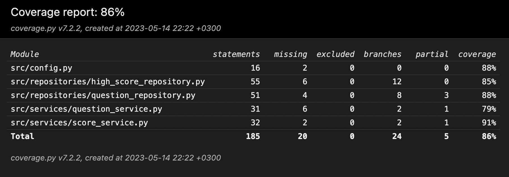

# Testausdokumentti

Sovelluksen testaus on toteutettu automatisoiduilla yksikkö- ja 
integraatiotesteillä (unittest). Lisäksi sovellusta on testattu 
manuaalisesti järjestelmätason testein.

## Yksikkö- ja integraatiotestaus

### Repositorio-luokat

Tiedostojen lukemisesta ja talletuksesta vastaavaa `QuestionRepository`-luokkaa testataan testiluokilla 
[TestQuestionRepositoryLocalFile](https://github.com/danieldenial/ot-harjoitus/blob/main/src/tests/repositories/question_repository_local_test.py) 
sekä 
[TestQuestionRepositoryOnlineFile](https://github.com/danieldenial/ot-harjoitus/blob/main/src/tests/repositories/question_repository_online_test.py). 
Näiden testiluokkien ero syntyy siitä, että ensimmäinen testaa pelin kysymysaineiston tuomista paikallisesti talletetulta tsv-tiedostolta, kun 
taas jälkimmäisessä testiluokassa kysymystiedosto löytyy ainoastaan verkosta (Google Sheets).

Pisteytykseen liittyvän tiedon lukemisesta, talletuksesta ja käsittelystä vastaavaa `HighScoreRepository`-luokkaa testataan puolestaan 
testiluokalla 
[TestHighScoreRepository](https://github.com/danieldenial/ot-harjoitus/blob/main/src/tests/repositories/high_score_repository_test.py).

Kaikki Repository-testiluokat luovat tiedostoja varten tilapäisen kansion, joka poistetaan testikerran päätteeksi. Käytettävät 
tiedostot poistuvat tietysti kansion mukana, ja ovat siis pelkästään testikäyttöön tarkoitettuja. Kansion ja tiedostojen nimet on 
konfiguroitu _.env.test_-tiedostoon.

Testiluokalle `HighScoreRepository` ei ole annettu valmiiksi testitiedostoja, vaan se luo ne 
luokan alustuksen yhteydessä, kuten todellisessakin käyttötilanteessa kävisi tiedostojen puuttuessa tai muun virhetilanteen kohdalla. 
Sovelluksen kanssa jaettavien, `HighScoreRepository`-luokan käyttämien oletustiedostojen toimivuus on testattu manuaalisesti.

Koska `QuestionRepository`-luokka ei muokkaa sen vastuulla olevaa dataa luettuaan sen sovellukseen, eivät testiversiot tiedostoista 
poikkea millään olennaisella tavalla sovelluksen normaalisti käyttämistä tiedostoista.

### Sovelluslogiikka

Sovelluslogiikasta vastaavia luokkia `QuestionService` ja `ScoreService` testataan testiluokilla 
[TestQuestionService](https://github.com/danieldenial/ot-harjoitus/blob/main/src/tests/services/question_service_test.py) ja 
[TestScoreService](https://github.com/danieldenial/ot-harjoitus/blob/main/src/tests/services/high_score_service_test.py). Näistä ensimmäinen 
alustetaan injektoimalla sille riippuvuudeksi `QuestionRepository`-olio, kun taas jälkimmäiselle injektoidaan riippuvuudeksi 
`HighScoreRepository`-olio. Nämä oliot on kuitenkin alustettu testejä varten luoduilla tiedostopoluilla, ja ne tallettavat testitiedostonsa 
tilapäiseen kansioon, joka testien päätteeksi poistetaan (kuten edellä kuvattiin).

### Testauskattavuus

Pois lukien käyttöliittymäkerros, on sovelluksen testauksen haaraumakattavuus lähemmäs 80% luokkaa.

Haaraumakattavuuden merkittävin puute on, että 

## Järjestelmätestaus

Sovelluksen järjestelmätestaus on suoritettu manuaalisesti.

### Asennus ja konfigurointi

Sovellus on haettu [käyttöohjeen](https://github.com/danieldenial/ot-harjoitus/blob/main/dokumentaatio/kayttoohje.md) neuvomalla tavalla 
testattavaksi sekä macOS- että Linux-ympäristöön. Näissä testeissä ei kuitenkaan ole käytetty toistaiseksi merkittävässä määrin eri konfiguraatioita.

### Toiminnallisuudet

[Vaatimusmäärittelydokumentissa](https://github.com/danieldenial/ot-harjoitus/blob/main/dokumentaatio/vaatimusmaarittely.md) ja käyttöohjeessa 
listatut toiminnallisuudet on käyty kaikki läpi. Koska sovelluksen kaikki syötteet ovat painikkeiden klikkauksia, on käytännössä kaikki 
käyttäjän potentiaalisesti etenemät polut ollut mahdollista käydä läpi. Todennäköisyys sovelluksen kaatumiselle on tällä erää hyvin matala. 
Isoimmat uhkakuvat sovelluksen vakaudelle syntyvät siitä, jos sen käyttämiä tiedostoja tai niiden polkuja muokataan.

## Sovellukseen jääneet tiedetyt laatuongelmat

Sovelluksen tässä vaiheessa luultavasti suurin laadullinen ongelma on, että pelinkulun näkymästä vastaava käyttöliittymän luokka 
`GameplayView` on paisunut liian suureksi ja käsittelee itselleen liian suuria vastuita. Luokan koodin refaktorointi ja jonkunlaisen uuden 
apuluokan luominen sille ovat sovelluksen tulevan kehityksen prioriteettilistan korkeimmassa päässä. Laveudestaan huolimatta luokka vaikuttaa 
toimivan niin kuin sen kuuluukin.
